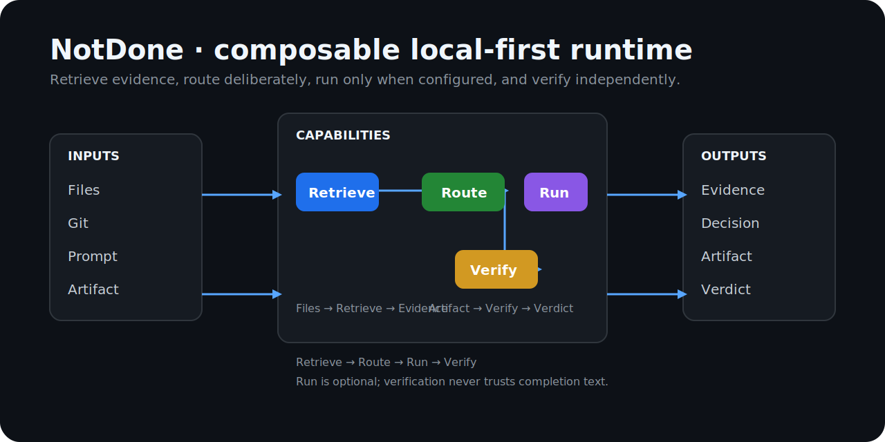

<!-- docs-revision: 2 -->

<p align="center">
  <strong>NotDone</strong><br>
  提供給 AI 代理程式的完成證明
</p>

<p align="center">
  
  <a href="https://github.com/bbdyno/NotDone/actions/workflows/ci.yml"></a>
  <a href="LICENSE"></a>
  
  
  
  
  <a href="https://github.com/bbdyno/NotDone/stargazers"></a>
</p>

<p align="center">
  <a href="README.md">English</a> |
  <a href="README_KO.md">한국어</a> |
  <a href="README_JA.md">日本語</a> |
  <a href="README_ZH-CN.md">简体中文</a> |
  <strong>繁體中文</strong>
</p>

# NotDone



> 代理程式說「完成了」，NotDone 要求它提出證據。

NotDone 是提供給 AI 程式開發代理程式的執行環境中立完成證明層。它會把驗收條件凍結為機器可讀的合約，從實際工具收集證據，並獨立判定代理程式是否有資格宣稱工作已完成。

> [!WARNING]
> v0.1.0 實作目前是發布候選版本。原始碼建置、獨立套件成品與三個執行環境整合皆已驗證，但尚未從此工作副本發布 npm 套件與 GitHub Release。

## 為什麼需要 NotDone？

AI 代理程式可能在沒有執行相關測試時回報成功、把部分修改誤認為完整結果，或以充滿信心的摘要掩蓋尚未驗證的假設。NotDone 會把代理程式的聲明與支援該聲明的證據分開處理。

- 在驗證前凍結完成條件。
- 不把模型產生的完成文字視為證據。
- 記錄指令、結束碼、Git 狀態、檔案、日誌、螢幕截圖與外部狀態。
- 將必要聲明判定為 `verified`、`unverified`、`blocked` 或 `failed`。
- 不必信任原始代理程式，也能重新驗證 proof packet。

## 支援的執行環境

| 執行環境 | 發布方式 | 明確呼叫 |
| --- | --- | --- |
| Claude Code | Marketplace plugin | `/notdone:verify` |
| Codex | Marketplace plugin 與 skill | `$notdone:verify` |
| Gemini CLI | Extension 與 custom command | `/notdone` 或 `/notdone:verify` |
| 任意 shell/CI | CLI | `notdone verify` |

各執行環境的 hook 只負責事件正規化與完成閘門。合約評估、證據儲存、雜湊與驗證均由共用核心處理。

## 快速開始

### 從目前的原始碼 checkout 安裝

需要 Node.js 22 或更新版本以及 pnpm 11.9.0。

```shell
git clone https://github.com/bbdyno/NotDone.git
cd NotDone
pnpm install --frozen-lockfile
pnpm build
npm install --global ./packages/cli ./packages/mcp-server
```

### CLI

v0.1.0 發布到 npm 後，請安裝下列兩個獨立套件：

```shell
npm install --global notdone notdone-mcp
notdone init
notdone contract validate
notdone verify
notdone proof inspect .notdone/proofs/<run-id>.proof.json
```

### Claude Code

在本機原始碼 checkout 中使用：

```text
/plugin marketplace add .
/plugin install notdone@notdone-marketplace
/notdone:verify
```

儲存庫發布後，遠端 Marketplace 流程如下：

```text
/plugin marketplace add bbdyno/NotDone
/plugin install notdone@notdone-marketplace
/notdone:verify
```

### Codex

在本機原始碼 checkout 中使用：

```shell
codex plugin marketplace add .
codex plugin add notdone@notdone-marketplace
```

儲存庫發布後，將 `.` 替換為 `bbdyno/NotDone`。安裝完成後，明確呼叫有
命名空間的 skill：

```text
$notdone:verify
```

### Gemini CLI

在本機原始碼 checkout 中使用：

```shell
gemini extensions link .
gemini extensions validate .
```

儲存庫發布後，使用
`gemini extensions install https://github.com/bbdyno/NotDone`。下列兩個
原生指令會執行相同的驗證流程：

```text
/notdone
/notdone:verify
```

## 可組合的本機優先工作流程

CLI 不會把尚未設定的 backend 表示為已經執行。

| 需求 | 指令 | 行為 |
| --- | --- | --- |
| 僅檢索 | `notdone retrieve <query> --json` | 搜尋允許的本機文字，並傳回 citation 與 evidence artifact。 |
| 僅驗證 | `notdone verify [contract-path]` | 不需檢索或模型即可執行獨立 proof workflow。 |
| 查看狀態 | `notdone backends --json`, `notdone packs --json` | 顯示本機檢索/驗證、選用模型狀態和宣告式 Pack。 |
| 說明組合 | `notdone run retrieve-model-verify <query> --profile Private --json` | 顯示 route、egress、citation、待驗證狀態和 backend 無法使用狀態。 |

支援 Retrieve、Verify、Run、Retrieve → Run、Run → Verify 與 Retrieve → Run → Verify。`Private` profile 會拒絕外部網路；`Saver` 和 `Quality` 的遠端路徑需要核准。模型 backend 預設未設定。

## 運作方式

```text
工作需求
    ↓
凍結的工作合約
    ↓
代理程式執行 + 正規化執行環境事件
    ↓
NotDone 收集證據
    ↓
決定性驗證
    ↓
Proof packet + 報告 + 完成閘門
```

```yaml
id: task-123
title: 修正登入崩潰
claims:
  - id: regression-test
    statement: 登入回歸測試通過
    required: true
    checks:
      - type: command
        command: npm test -- login-crash
        expect:
          exitCode: 0
```

## 信任模型

| 等級 | 意義 |
| --- | --- |
| `self-reported` | 只有代理程式的文字聲明，不可作為完成證據 |
| `observed` | 執行環境 hook 觀察到工具事件 |
| `executed` | NotDone 執行合約中定義的檢查 |
| `reproduced` | 獨立驗證重新執行相同檢查 |
| `attested` | CI 或遠端驗證器簽署結果；協定中已定義，但本機收集器尚未產生 |

本機 v0.1 實作的目標是誠實但可能犯錯的代理程式。它會偵測缺乏根據的完成聲明與遭竄改的 proof packet，但不宣稱能完全抵禦擁有相同作業系統權限的惡意程序。詳情請參閱[威脅模型](docs/threat-model.md)。

## 專案狀態

v0.1.0 發布候選版本包含：

- 具版本的 protocol schema、canonical JSON 與 SHA-256 packet integrity
- 決定性的 command、file 與 Git diff 驗證
- 可獨立執行的 `notdone` CLI 與 `notdone-mcp` 套件
- Claude Code、Codex、Gemini CLI 原生發布與完成閘門
- 以 schema 為基礎的 cross-runtime conformance 測試
- Node.js 22/24 CI、套件安裝測試、相依性審查、發布 checksum、
  npm provenance 與 GitHub build attestation

剩餘發布操作是公開 npm 套件與 `v0.1.0` GitHub Release。詳情請參閱
[ROADMAP.md](ROADMAP.md)、[協定](docs/protocol.md)、
[CLI 參考](docs/cli.md)、[MCP 參考](docs/mcp.md)與
[發布流程](RELEASING.md)。

## 驗證目前的 checkout

```shell
pnpm check
pnpm pack:release
pnpm pack:verify
```

第一個指令會執行 type check、unit test、執行環境 hook test、conformance，
以及文件與整合檢查。套件指令會建置兩個 npm tarball、安裝到隔離環境，
並驗證 CLI、MCP server 回應與授權條款內容。

## 貢獻與授權

提出變更前請閱讀 [CONTRIBUTING.md](CONTRIBUTING.md)。安全性問題請依照 [SECURITY.md](SECURITY.md) 私下回報，不要建立公開 Issue。

NotDone 採用 [Apache License 2.0](LICENSE)。
